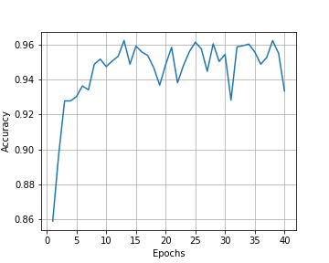

# **Traffic Sign Recognition** 

## Writeup

---

**Build a Traffic Sign Recognition Project**

The goals / steps of this project are the following:
* Load the data set (see below for links to the project data set)
* Explore, summarize and visualize the data set
* Design, train and test a model architecture
* Use the model to make predictions on new images
* Analyze the softmax probabilities of the new images
* Summarize the results with a written report

[image_50limit]: ../test_sample/50limit.png "Traffic Sign 50KM/h Limit"
[image_forward]: ../test_sample/forward.png "Forward Only"
[image_right]: ../test_sample/right.png "Right turn"
[image_roadwork]: ../test_sample/roadwork.png "Roadwork"
[image_stop]: ../test_sample/stop.png "Stop sign"
[distribution]: ./image_output/dataset_distribution.png "Dataset distribution"
[distribution_after]: ./image_output/dataset_distribution_after_distribution.png "Dataset distribution"

## Rubric Points
### Here I will consider the [rubric points](https://review.udacity.com/#!/rubrics/481/view) individually and describe how I addressed each point in my implementation.  

# Project

The project implementation can be found [Traffic_Sign_Classifier.ipynb](Traffic%20Sign%20Classifier.ipynb).  It consists in five steps.

### Step 0: Load The Data
In this steps, the provided data is loaded using the `pickle` library.
The images have labels to recognize what they represent. The labels are numbers, but there is a [.csv file](data/signnames.csv) containing the mapping between the labels and a text name of the image to make it more human-friendly.

### Step 1 : Dataset Summary & Exploration

Here the data set is explored. First, show some general numbers about it:

- Number of training examples = 34799
- Number of testing examples = 12630
- Number of validation examples = 4410
- Image data shape = (32, 32, 3)
- Number of classes = 43

We have 43 different traffic signs. One image from each class:

and the distribution of the labels is presented:

### Step 2: Design and Test a Model Architecture

#### 1. Preprocessing

I normalized the image data because images should not be diffrentiate based on pixels brigher or darker. so we normalized all the images to be `(pixels - 128.)/128.`

I decided to generate additional data, as we can see the images with label 1,2,38 is way more than the others, and other labels like 19 has only around 200 images. so we need to do data augmentation. the strategies applied for augmentation are:

- scaling image from 1.0-1.2.
- translation image from -5-5.
- random rotation -45-45 degrees.

we apply this strategy to the images with labels less than 3% of the whole training set.

then the training dataset distribution becomes: 

#### 2. Describe what your final model architecture looks like including model type, layers, layer sizes, connectivity, etc.) Consider including a diagram and/or table describing the final model.

The initial model came from [LeNet](http://yann.lecun.com/exdb/lenet/) from [Udacity](https://github.com/udacity/CarND-LeNet-Lab). The final model is composed to take care of RGB layers with structure:

| Layer         		|     Description	        					| 
|:---------------------:|:---------------------------------------------:| 
| Input         		| 32x32x3 RGB image   							| 
| Convolution 5x5     	| 1x1 stride, valid padding, outputs 28x28x16	|
| RELU					|												|
| Max pooling	      	| 2x2 stride,  outputs 14x14x16					|
| Convolution 5x5     	| 1x1 stride, valid padding, outputs 10x10x48 	|
| RELU					|												|
| Max pooling	      	| 2x2 stride,  outputs 5x5x48					|
| Flatten 				| outputs 1200 neurons.							|
| Fully connected 1		| outputs 240     								|
| Dropout				| 0.75											|
| Fully connected 2		| outputs 84    								|
| Dropout				| 0.75											|
| Fully connected 3		| outputs 43									|
 

#### 3. Describe how you trained your model. The discussion can include the type of optimizer, the batch size, number of epochs and any hyperparameters such as learning rate.

To train the model, I used 40 epochs, with batch size 128, dropout rate set to 0.75 after the first and second fully connected layers, set the learning rate to be 0.0009 to make the convergence slightly slower. As a pretty typical choice, I used `AdamOptimizer` as the optimizer. 

Here's how the convergence looks as the number of epochs grow:

The final validation accuracy for the model is staying from 0.934 to 0.96.

### Step 3 Test a Model on New Images

#### 1. Choose five German traffic signs found on the web and provide them in the report. For each image, discuss what quality or qualities might be difficult to classify.

Here are five German traffic signs that I found on the web:

![alt text][image_50limit] ![alt text][image_forward] ![alt text][image_right]
![alt text][image_roadwork] ![alt text][image_stop]

The fourth road work image might be difficult to classify because the image contains trivial details, and the image itself is slightly rotated.

#### 2. Discuss the model's predictions on these new traffic signs and compare the results to predicting on the test set. At a minimum, discuss what the predictions were, the accuracy on these new predictions, and compare the accuracy to the accuracy on the test set (OPTIONAL: Discuss the results in more detail as described in the "Stand Out Suggestions" part of the rubric).

Here are the results of the prediction:

| Image			        |     Prediction	        					| 
|:---------------------:|:---------------------------------------------:| 
| Speed limit (50km/h)	| Speed limit (50km/h)   						| 
| Ahead only     		| Ahead only 									|
| Turn right ahead		| Turn right ahead								|
| road work	      		| road work						 				|
| Stop 		 		 	| Stop  										|

The model was able to correctly guess 5of the 5 traffic signs, which gives an accuracy of 100%. This compares favorably to the accuracy on the test set of 94.418%.

#### 3. Describe how certain the model is when predicting on each of the five new images by looking at the softmax probabilities for each prediction. Provide the top 5 softmax probabilities for each image along with the sign type of each probability. (OPTIONAL: as described in the "Stand Out Suggestions" part of the rubric, visualizations can also be provided such as bar charts)

The code for making predictions on my final model is located in the 44th cell of the Ipython notebook.

Image: 50limit.png
Probabilities:
   1.000000 : 2 - Speed limit (50km/h)
   0.000000 : 5 - Speed limit (80km/h)
   0.000000 : 0 - Speed limit (20km/h)
   0.000000 : 1 - Speed limit (30km/h)
   0.000000 : 3 - Speed limit (60km/h)
Image: forward.png
Probabilities:
   1.000000 : 35 - Ahead only
   0.000000 : 0 - Speed limit (20km/h)
   0.000000 : 1 - Speed limit (30km/h)
   0.000000 : 2 - Speed limit (50km/h)
   0.000000 : 3 - Speed limit (60km/h)
Image: right.png
Probabilities:
   1.000000 : 33 - Turn right ahead
   0.000000 : 0 - Speed limit (20km/h)
   0.000000 : 1 - Speed limit (30km/h)
   0.000000 : 2 - Speed limit (50km/h)
   0.000000 : 3 - Speed limit (60km/h)
Image: roadwork.png
Probabilities:
   1.000000 : 25 - Road work
   0.000000 : 0 - Speed limit (20km/h)
   0.000000 : 1 - Speed limit (30km/h)
   0.000000 : 2 - Speed limit (50km/h)
   0.000000 : 3 - Speed limit (60km/h)
Image: stop.png
Probabilities:
   1.000000 : 14 - Stop
   0.000000 : 15 - No vehicles
   0.000000 : 1 - Speed limit (30km/h)
   0.000000 : 26 - Traffic signals
   0.000000 : 0 - Speed limit (20km/h)

### (Optional) Visualizing the Neural Network (See Step 4 of the Ipython notebook for more details)
#### 1. Discuss the visual output of your trained network's feature maps. What characteristics did the neural network use to make classifications?

As visualized in the notebook. It's pretty cool to see that after the first convolution layer, the details are extracted from the images. For example, the first 50KM/h sign, we can see that the sign is a circle, with a 50 sign in the middle.

